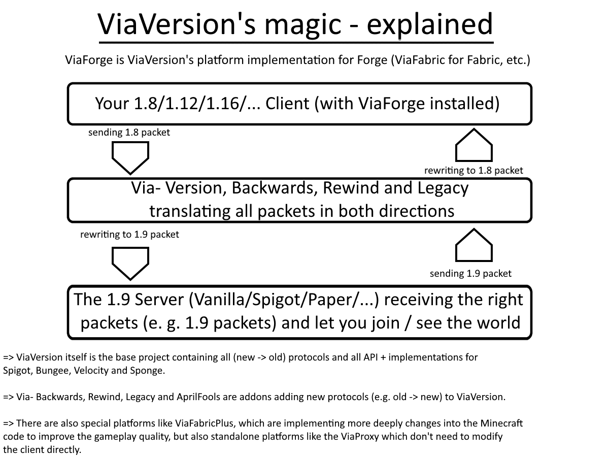

# ViaForge
Client-side Implementation of the Via* projects for Minecraft Forge

## Contact
If you encounter any issues, please report them on the
[issue tracker](https://github.com/ViaVersion/ViaForge/issues).  
If you just want to talk or need help with ViaForge feel free to join the ViaVersion
[Discord](https://discord.gg/viaversion).

## For users
### Where can I download the latest version?
CurseForge: https://www.curseforge.com/minecraft/mc-mods/viaforge

Modrinth: https://modrinth.com/mod/viaforge

GitHub Releases: https://github.com/ViaVersion/ViaForge

### How does it work?

## For developers
### Project Structure
All ViaForge versions from Minecraft version 1.12.2 onwards are on the `master` branch.  
The names of the submodules indicate the version, they are always given in the format `mc-<version name without .>`.  
`Minecraft 1.12.2` - `viaforge-mc1122`  
`Minecraft 1.16.5` - `viaforge-mc1165`  
`Minecraft 1.17.1` - `viaforge-mc1171`  
`Minecraft 1.18.2` - `viaforge-mc1182`  
`Minecraft 1.19.4` - `viaforge-mc1194`  
`Minecraft 1.20.4` - `viaforge-mc1204`  

### ViaForge for Minecraft 1.8
Since ForgeGradle for Minecraft 1.8.9 is too old, it has its own branch called `legacy-1.8`

### I want ViaForge in my own utility mod
Just take a look at my other Project called `ViaMCP`: https://github.com/FlorianMichael/ViaMCP

## For developers
### How to build
1. Clone the repository with `git clone`.
2. Run `./gradlew build` in the root directory of the repository.
3. The compiled jar files can be found in `viaforge-mc<version>/build/libs`.

Note: Build scripts are made to be run using Java 17.

## Other ViaVersion Mods / Platforms
- ViaFabric - https://modrinth.com/mod/viafabric
- ViaFabricPlus - https://github.com/ViaVersion/ViaFabricPlus (Includes additional modifications to make the experience better)
- ViaProxy (App) - https://github.com/ViaVersion/ViaProxy
- ViaaaS (Proxy) - https://github.com/ViaVersion/ViaaaS

### If you want to talk with me, feel free to join my [Discord](https://discord.gg/BwWhCHUKDf)
