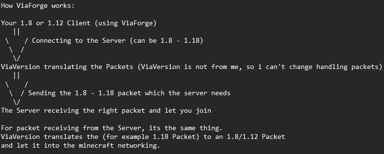

# ViaForge
Client-side Implementation of ViaVersion, ViaBackwards and ViaRewind for Legacy Minecraft Forge

## Contact
If you encounter any issues, please report them on the
[issue tracker](https://github.com/FlorianMichael/ViaForge/issues).  
If you just want to talk or need help with ViaForge feel free to join the ViaVersion
[Discord](https://discord.gg/viaversion).

## For users
### Where can I download the latest version?
CurseForge: https://www.curseforge.com/minecraft/mc-mods/viaforge
Modrinth: https://modrinth.com/mod/viaforge

### Can you add new textures and blocks from higher versions?
No, because it is too time-consuming

### ViaVersion throws an error, or I can't access a server, what should I do?
First of all see if it's because of an installed mod, otherwise come to the support Discord and tell me logs, mc version etc.

### Certain collisions or other items bug, can you fix it?
No

## For developers
### How does it work?

### Project Structure
All ViaForge versions from Minecraft version 1.12 onwards are on the `master` branch.  
The names of the submodules indicate the version, they are always given in the format `mc-<version name without .>`.  
`Minecraft 1.12.2` - `mc1122`

### ViaForge for Minecraft 1.8
Since ForgeGradle for Minecraft 1.8 is too old, it has its own branch called `legacy-1.8`

### I want ViaForge in my own utility mod
Just take a look at my other Project called `ViaMCP`: https://github.com/FlorianMichael/ViaMCP

## Other ViaVersion Mods / Platforms
- ViaFabric - https://modrinth.com/mod/viafabric
- ViaFabricPlus - https://github.com/ViaVersion/ViaFabricPlus#readme (Includes additional modifications to make the experience better)
- ViaProxy (App) - https://github.com/ViaVersion/ViaProxy/#readme
- ViaaaS (Proxy) - https://github.com/ViaVersion/ViaaaS#readme 
